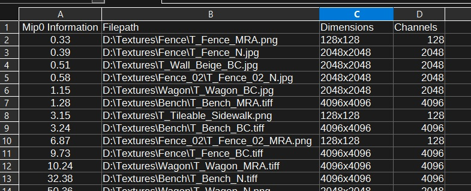

# Mip Explorer

The Mip Explorer is a tool to quickly find needlessly large textures that don't lose noticeable details when using smaller mip maps. It can be used in 2 ways:
1.  Select individual texture files to plot a graph of how much detail is stored in each mip map.
2.  Process a directory to get a list all textures, sorted by the information present in mip 0.

# How it works
The **[Laplacian Pyramid](https://docs.nvidia.com/vpi/algo_laplacian_pyramid_generator.html)** is a way to represent an image as a set of band-pass images, each one containing a certain range of frequencies.

If you already have a mip map chain for a texture, creating the Laplacian pyramid is quite simple. Each mip map becomes a frequency band in a Laplacian pyramid when you subtract the next smaller mip from it.

This gives you an interesting new way of looking at and understanding the relationship between different mip maps. By calculating the sum of all pixels for each frequency band and dividing it by the number of pixels, we get a measure of how much texture information is stored in each frequency band/mip map. This can facilitate discussions about how textures should behave at specific mip map levels. For example, for fast-paced multiplayer action games, you may want to have **[telescoping](https://www.artstation.com/artwork/mA8AVv)** textures that have a lot of high-frequency detail that mips away quickly to keep the image easy to read in typical gameplay situations, but still have enough detail when players look more closely at their surroundings.

The Mip Explorer calculates these frequency distributions and presents them in a graph:


As you can see in the screenshots above, the gravel texture has most of its information stored in mips 2-4, while the rusty metal texture has mostly lower frequencies. Therefore, most of its information is stored in mips 6-8. Depending on your use case, you may want to remove mip 0 from the metal texture since it doesn't contribute much anyway, or you may want to add some low-frequency detail to the gravel texture since you want the texture to be noticeable from a distance.

While the calculation is relatively fast, it also stores the result in a cache that is saved between sessions to make browsing through your textures as fast as possible.

# Scanning directories
If you have a project with thousands of textures and you notice that your textures are too big in memory, this feature helps you to find low-hanging fruits quickly.

When clicking on the "Scan Directory" button, the Mip Explorer calculates the information density in mip 0 for each texture in the current directory and sub-directories. The results are written to a csv file in the current directory, sorted by the information density. This list helps you to find the textures in your project that can be scaled down with the least visual impact:


For more information about how the Mip Explorer came to be, check out **[this blog post](https://haukethiessen.com/introducing-the-mip-explorer/)**.

# Work modes:
The Mip Explorer offers 3 modes for different types of textures:

🎨 For color textures, the luminosity is calculated.

📅  For data textures, a simple average of the channels is used.

🚦  For a more detailed analysis, you can also display the results per channel.

⬆️  The normal map mode normalizes each mip and uses the angles between the normal vectors to calculat the differences
The modes can be selected manually or automatically based on file name suffixes.

# FAQ:
## As an artist, do I need the Mip Explorer?
It depends. The option to show the information density per mip map is not intended as a tool to be used regularly in a real production. It's meant to be a demonstration tool and illustrates some characteristics of mip maps that not all people are usually aware of. The option to calculate Mip 0 information densities exists to be used during the optimization phase of an actual production. But even then, it shouldn't be used as the final source of truth. Human perception tends to differ from what the numeric differences of the mip maps imply, and the Mip Explorer doesn't know anything about how the textures are used in your game. So if in doubt, trust your own judgement.

## What do I need to run the Mip Explorer?
Mip Explorer has been developed and tested on Windows 11. Some features (dark/light UI mode, drag-and-drop of files from outside) depend on Windows. Here and there, I've also implemented alternatives for MacOS, but I haven't tested them myself, and further work would be needed to make it run. If you do test it on a Mac, please let me know your results. Same if you're a Linux user.

The tool is completely written in Python 3.13.2 and has some dependencies that are not part of the standard Python library. Please see the included **requirements.txt** for details.

There is also a batch file, called InstallRequiredLibs.bat in the root directory, which you can run to install the latest versions of the required libraries.

# Which file formats are supported?
The supported formats are: bmp, dib, jp(e)g, jpe, jp2, png, webp, pbm, pgm, ppm, pxm, pnm, sr, ras, tif(f), tga and pic. 

Please note that most of these formats come in a range of flavors and with different optional features, so there's a chance that a file isn't accpepted even if it's a nominally supported file type. I didn't test any file formats myself other than bmp, tiff, png, tga, webp and jpg.

## I found a bug!
Please contact me: https://bsky.app/profile/haukethiessen.bsky.social or https://mastodon.gamedev.place/@haukethiessen

I'm always happy to get feedback and fix any errors that you may find.

# License
Mip Explorer is free to use for both non-commercial and commercial projects:
```
Mip Explorer
Copyright (c) Hauke Thiessen

This software is provided 'as-is', without any express or implied
warranty. In no event will the authors be held liable for any damages
arising from the use of this software.

Permission is granted to anyone to use this software for any purpose,
including commercial applications, and to alter it and redistribute it
freely, subject to the following restrictions:

1. The origin of this software must not be misrepresented; you must not
    claim that you wrote the original software. If you use this software
    in a product, an acknowledgment in the documentation is be
    appreciated but not required.

2. Altered versions must be plainly marked as such, and must not be
    misrepresented as being the original software.

3. This notice may not be removed or altered from any source distribution.
```

