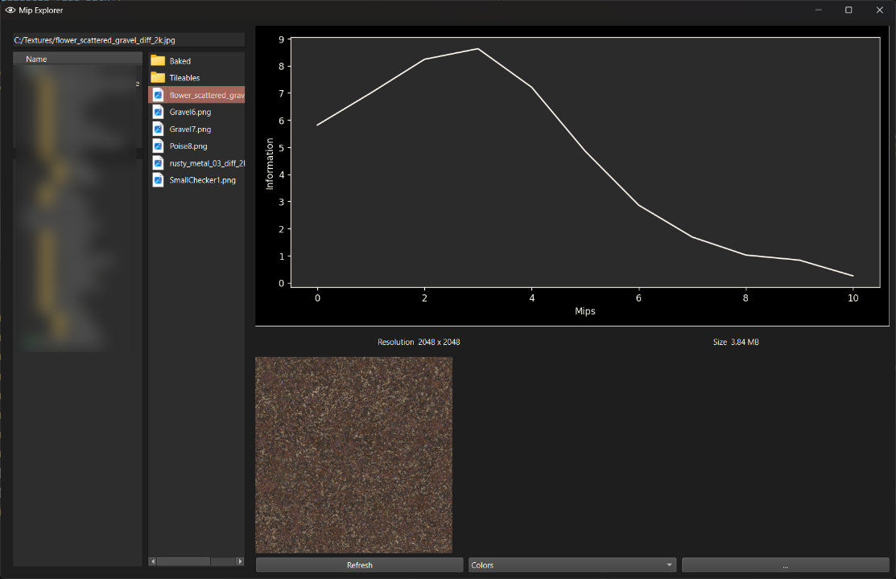
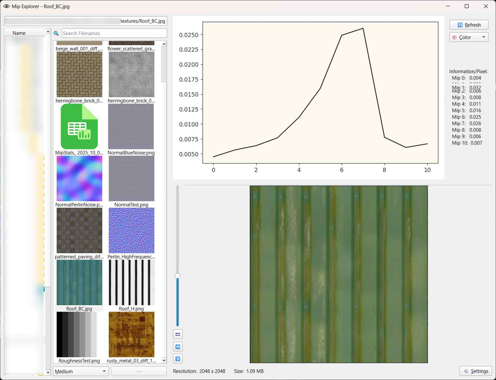

# Laplacian Pyramid Stats Viewer

The **Laplacian Pyramid** is a way to represent an image as a set of band-pass images, each one containing a certain range of frequencies:
https://docs.nvidia.com/vpi/algo_laplacian_pyramid_generator.html
When you already have a mip map chain for a texture, creating the Laplacian Pyramid is quite simple. Each mip map becomes a frequency band in a Laplacian Pyramid once you subtract the next-smaller mip from it.
That gives you an interesting new way of looking at and understanding the relationship between the different mip maps. By calculating the sum of all pixels for each frequency band and dividing it by the number of pixels, we get a measurement of how much of the texture information is stored in each frequency band/mip map. This can facilitate discussions about how textures should behave at specific mip map levels. For fast-paced multiplayer action games for example, you may want to have '**telescoping**' textures that have a lot of high-frequency details that mip away quickly, to keep the image easy to read in typical gameplay situations, but have sufficient details once players take a closer look at their environment (https://www.artstation.com/artwork/mA8AVv).
The Mip Explorer calculates these frequency distributions and presents them in a graph:



You can see in the screenshots how the gravel texture has most of its information stored in the mips 2-4, while the rusty metal texture has mostly lower frequencies. Therefore, most of its information is stored in the mips 6-8.

While the calculation is relatively fast, it also stores the result in a cache that gets saved between sessions, to make browsing through your textures as fast as possible.

Other features include:
- Switching between different modes, to either graph color channels individually, the calculated luminance or the simple average of the channels
- Automatic suffix-based mode selection
- Dark/Light UI mode depending on your system's settings

# FAQ:
## Do I need the Mip Explorer as an artist?
The Mip Explorer is not primarily intended as a tool that gets used regularly in an actual production. It's supposed to be a demonstration tool and illustrates some characteristics of mip maps that not all people are usually aware of.

## What do I need to run the Mip Explorer?
The Mip Explorer was developed and tested on Windows 11. Some features (dark/light UI mode, drag-and-drop of files from outside) rely on Windows. I did also implement matching alternatives for MacOS, but I didn't test them myself. So it may run fine on MacOS, but I don't know. In case you test running it on a Mac, please tell me your results.
The tool is written completely in Python 3.13.2 and has sevearal dependencies that are not part of the Python standard library. Please check the provided **requirements.txt** for details.

## I found a bug!
Please reach out to me: https://bsky.app/profile/haukethiessen.bsky.social
I'm always happy to get feedback and fix any errors that you may find.

# License
Mip Explorer is free to use for both non-commercial and commercial projects:
```
Mip Explorer
Copyright (c) Hauke Thiessen

This software is provided 'as-is', without any express or implied
warranty. In no event will the authors be held liable for any damages
arising from the use of this software.

Permission is granted to anyone to use this software for any purpose,
including commercial applications, and to alter it and redistribute it
freely, subject to the following restrictions:

1. The origin of this software must not be misrepresented; you must not
    claim that you wrote the original software. If you use this software
    in a product, an acknowledgment in the documentation is be
    appreciated but not required.

2. Altered versions must be plainly marked as such, and must not be
    misrepresented as being the original software.

3. This notice may not be removed or altered from any source distribution.
```