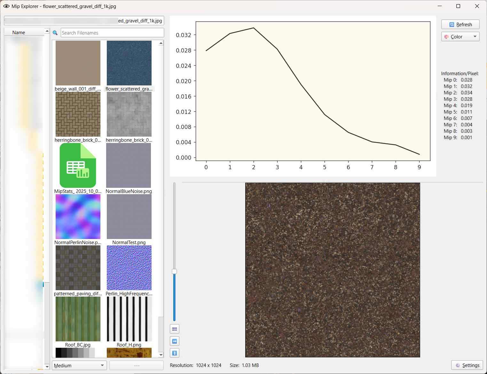

# Laplacian Pyramid Stats Viewer

The **** is a way to represent an image as a set of band-pass images, each one containing a certain range of frequencies:


If you already have a mip map chain for a texture, creating the Laplacian pyramid is quite simple. Each mip map becomes a frequency band in a Laplacian pyramid when you subtract the next smaller mip from it.
This gives you an interesting new way of looking at and understanding the relationship between different mip maps. By calculating the sum of all pixels for each frequency band and dividing it by the number of pixels, we get a measure of how much texture information is stored in each frequency band/mip map. This can facilitate discussions about how textures should behave at specific mip map levels. For example, for fast-paced multiplayer action games, you may want to have **** textures that have a lot of high-frequency detail that mips away quickly to keep the image easy to read in typical gameplay situations, but still have enough detail when players look more closely at their surroundings.
The Mip Explorer calculates these frequency distributions and presents them in a graph:



As you can see in the screenshots above, the gravel texture has most of its information stored in mips 2-4, while the rusty metal texture has mostly lower frequencies. Therefore, most of its information is stored in mips 6-8. Depending on your use case, you may want to remove mip 0 from the metal texture since it doesn't contribute much anyway, or you may want to add some low frequency detail to the gravel texture since you want the texture to be noticeable from a distance.

While the calculation is relatively fast, it also stores the result in a cache that is saved between sessions to make browsing through your textures as fast as possible.

Other features include:
- Switching between different modes, to either graph color channels individually, the calculated luminance or the simple average of the channels
- Automatic suffix-based mode selection
- Dark/Light UI mode depending on your system's settings

# FAQ:
## As an artist, do I need the Mip Explorer?
The Mip Explorer is not primarily intended as a tool to be used regularly in a real production. It's meant to be a demonstration tool and illustrates some characteristics of mip maps that not all people are usually aware of.

## What do I need to run the Mip Explorer?
Mip Explorer has been developed and tested on Windows 11. Some features (dark/light UI mode, drag-and-drop of files from outside) depend on Windows. I've also implemented alternatives for MacOS, but I haven't tested them myself. So it might work fine on MacOS, but I don't know. If you do test it on a Mac, please let me know your results.
The tool is completely written in Python 3.13.2 and has some dependencies that are not part of the standard Python library. Please see the included **requirements.txt** for details.

## I found a bug!
Please contact me: https://bsky.app/profile/haukethiessen.bsky.social
I'm always happy to get feedback and fix any errors that you may find.

# License
Mip Explorer is free to use for both non-commercial and commercial projects:
```
Mip Explorer
Copyright (c) Hauke Thiessen

This software is provided 'as-is', without any express or implied
warranty. In no event will the authors be held liable for any damages
arising from the use of this software.

Permission is granted to anyone to use this software for any purpose,
including commercial applications, and to alter it and redistribute it
freely, subject to the following restrictions:

1. The origin of this software must not be misrepresented; you must not
    claim that you wrote the original software. If you use this software
    in a product, an acknowledgment in the documentation is be
    appreciated but not required.

2. Altered versions must be plainly marked as such, and must not be
    misrepresented as being the original software.

3. This notice may not be removed or altered from any source distribution.
```
